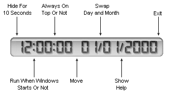



## \[   LCD Clock v1\.14   \]

### Description

LCD Clock v1.14

Very beautiful LCD Clock.
 
### More Info
 

             |
---                |---
**Submitted On**   |2004-08-07 00:08:58
**By**             |[Michael Margold](https://github.com/Planet-Source-Code/PSCIndex/blob/master/ByAuthor/michael-margold.md)
**Level**          |Advanced
**User Rating**    |4.6 (134 globes from 29 users)
**Compatibility**  |VB 6\.0
**Category**       |[Complete Applications](https://github.com/Planet-Source-Code/PSCIndex/blob/master/ByCategory/complete-applications__1-27.md)
**World**          |[Visual Basic](https://github.com/Planet-Source-Code/PSCIndex/blob/master/ByWorld/visual-basic.md)
**Archive File**   |[\[\_\_\_LCD\_Cl188319512005\.zip](https://github.com/Planet-Source-Code/michael-margold-lcd-clock-v1-14__1-55440/archive/master.zip)

